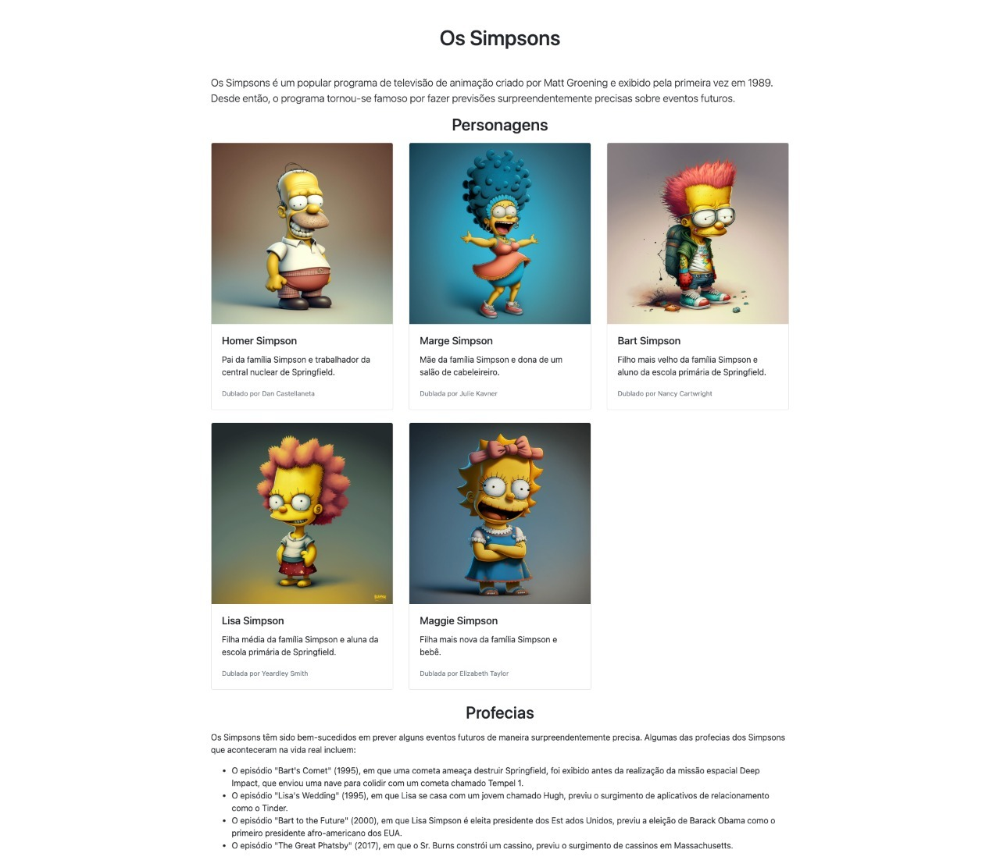
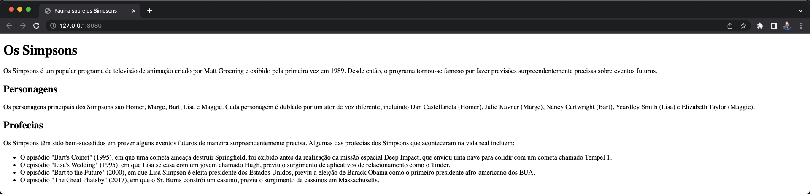
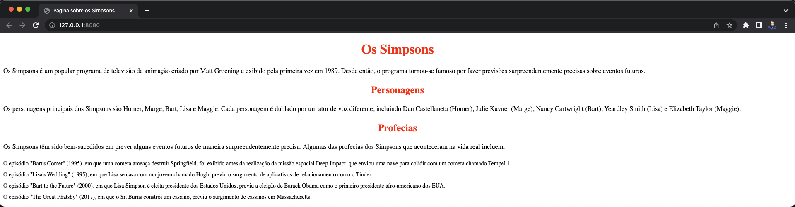
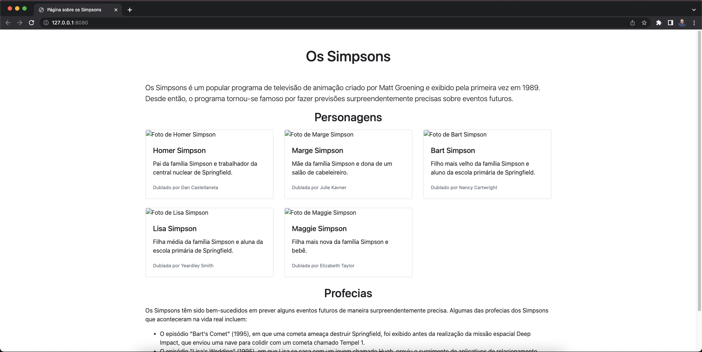
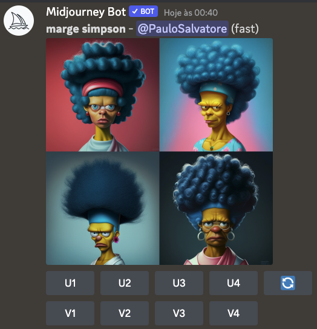
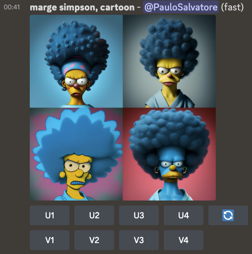
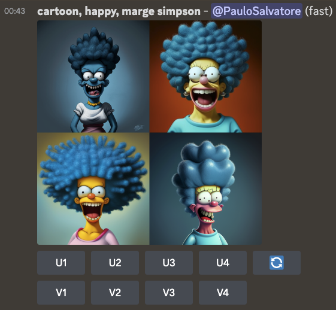
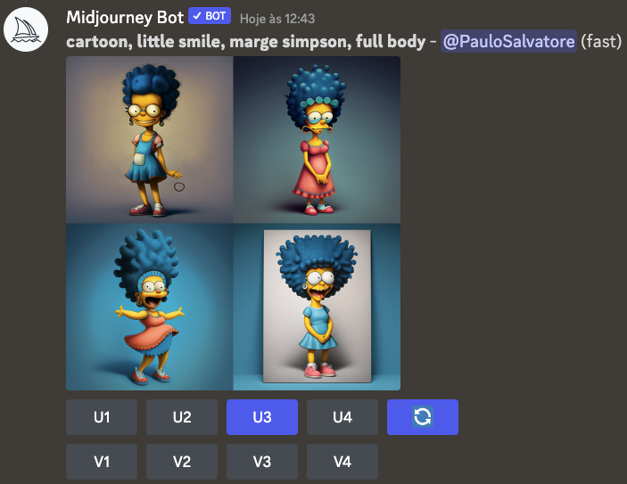
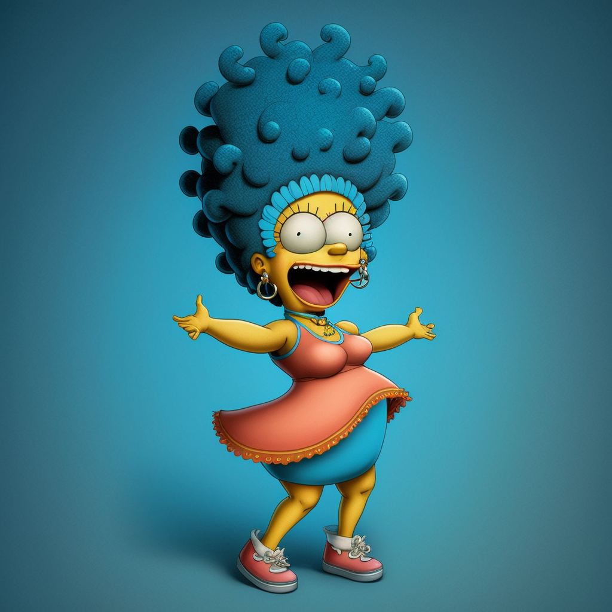

# POC IA - Simpsons

Esse projeto foi feito testando a tecnologia de geração de código do [ChatGPT](https://openai.com/blog/chatgpt/), combinando com a tecnologia de geração de imagens [Midjourney](https://midjourney.com/). O código gerado pelo ChatGPT foi inserido no Visual Studio Code, utilizando a tecnologia do [GitHub Copilot](https://github.com/features/copilot) para auxiliar no processo de organização do código.

As três tecnologias mencionadas utilizam a GPT-3 (*Generative Pre-Training Transformer 3*), que é um modelo de linguagem autorregressivo que usa aprendizagem profunda para produzir conteúdos. O modelo foi lançado no dia 11 de junho de 2020 e pode ser acessado pelo [site da OpenAI](https://openai.com/blog/openai-api/).

### Acesse meu canal no YouTube

https://www.youtube.com/paulosalvatore

## Visualizando o resultado

O site com o resultado está disponível no link a seguir:

https://paulosalvatore.github.io/poc-ia-simpsons



## Como foi o processo de geração do código?

Após abrir o [Chat da OpenAI](https://chat.openai.com/), a seguinte conversa foi desenvolvida:

### Iniciando a conversa

> **Paulo Salvatore:** Não sei se é lenda urbana, mas dizem que o Cartman é dublado pela mesma pessoa. Na real a lenda é que todos os personagens principais são dublados pela mesma pessoa, é real isso?

> **Chat OpenAI:** Não, essa é uma lenda urbana. Cada personagem em "South Park" é dublado por um ator de voz diferente. Eric Cartman é dublado pelo ator de voz Matt Stone, enquanto os outros personagens principais, como Stan Marsh, Kyle Broflovski e Kenny McCormick, são dublados por Trey Parker, Isaac Hayes e Matt Stone, respectivamente. Além disso, há muitos outros personagens em "South Park" que são dublados por atores de voz diferentes. É comum em produções de animação que cada personagem tenha seu próprio ator de voz, a fim de dar vida a cada personagem de maneira única e especial.

> **Paulo Salvatore:** Pode pá! No Rick and morty é a mesma coisa?

> **Chat OpenAI:** Sim, é a mesma coisa em "Rick and Morty". Cada personagem em "Rick and Morty" é dublado por um ator de voz diferente. Rick Sanchez é dublado pelo ator de voz Justin Roiland, enquanto Morty Smith é dublado pelo ator de voz Chris Parnell. Além disso, há muitos outros personagens em "Rick and Morty" que são dublados por atores de voz diferentes, incluindo Summer Smith, Beth Smith, Jerry Smith e muitos outros. É comum em produções de animação que cada personagem tenha seu próprio ator de voz, a fim de dar vida a cada personagem de maneira única e especial.

> **Paulo Salvatore:** Quais são as profecias dos Simpsons que aconteceram na vida real?

> **Chat OpenAI:** Os Simpsons são um programa de televisão de animação criado por Matt Groening e exibido pela primeira vez em 1989. Desde então, o programa tornou-se famoso por fazer previsões surpreendentemente precisas sobre eventos futuros. Algumas das profecias dos Simpsons que aconteceram na vida real incluem:
>
> 1. O episódio "Bart's Comet" (1995), em que uma cometa ameaça destruir Springfield, foi exibido antes da realização da missão espacial Deep Impact, que enviou uma nave para colidir com um cometa chamado Tempel 1.
> 2. O episódio "Lisa's Wedding" (1995), em que Lisa se casa com um jovem chamado Hugh, previu o surgimento de aplicativos de relacionamento como o Tinder.
> 3. O episódio "Bart to the Future" (2000), em que Lisa Simpson é eleita presidente dos Estados Unidos, previu a eleição de Barack Obama como o primeiro presidente afro-americano dos EUA.
> 4. O episódio "The Great Phatsby" (2017), em que o Sr. Burns constrói um cassino, previu o surgimento de cassinos em Massachusetts.
>
> Essas são apenas algumas das profecias dos Simpsons que aconteceram na vida real. É importante notar que, embora os Simpsons tenham sido bem-sucedidos em prever alguns eventos futuros, eles também têm incorrido em erros, como em seu episódio "Bart's Girlfriend" (1994), em que eles previram que o cantor Tony Bennett morreria em 1994. Bennett, felizmente, ainda está vivo e atuando.

> **Paulo Salvatore:** Manda mais pa nóis ae, please

> **Chat OpenAI:** Claro! Aqui estão alguns outros exemplos de profecias dos Simpsons que aconteceram na vida real:
>
> 5. O episódio "Marge in Chains" (1993), em que Springfield é afetada por uma epidemia de gripe, previu a pandemia de gripe H1N1 de 2009.
> 6. O episódio "Homer's Phobia" (1997), em que Homer se torna um colecionador de antiguidades, previu o aumento da popularidade de programas de TV como "Antiques Roadshow".
> 7. O episódio "Bart to the Future" (2000), em que Lisa Simpson é eleita presidente dos Estados Unidos, também previu o aumento da polarização política nos EUA.
> 8. O episódio "Bart's Girlfriend" (1994), em que o personagem principal, Bart Simpson, é expulso da escola, previu o aumento da preocupação com a segurança escolar nos EUA após os tiroteios em escolas.
> 9. O episódio "Homer's Phobia" (1997), em que Homer se torna um colecionador de antiguidades, também previu o aumento da popularidade de programas de TV como "American Pickers" e "Pawn Stars".
> 10. O episódio "The Computer Wore Menace Shoes" (2001), em que Homer cria um site de notícias, previu o surgimento de sites de notícias online, como o Huffington Post e o Buzzfeed.
>
> Essas são apenas algumas das muitas profecias dos Simpsons que aconteceram na vida real. É importante lembrar que essas profecias aconteceram porque os criadores dos Simpsons são muito observadores e têm um bom senso de humor, e não porque eles têm algum tipo de poder sobrenatural.

> **Paulo Salvatore:** Vc consegue me dizer qual o número de profecias existentes?

> **Chat OpenAI:** É difícil determinar um número exato de profecias dos Simpsons, pois o programa já esteve no ar por mais de 30 anos e tem mais de 600 episódios. Além disso, o que é considerado uma "profecia" é subjetivo e pode variar de pessoa para pessoa. Algumas pessoas podem considerar qualquer previsão surpreendentemente precisa em um episódio como uma profecia, enquanto outras podem ser mais exigentes e considerar apenas previsões que aconteceram anos depois de um episódio ter sido exibido.
>
> Com isso em mente, é seguro dizer que há muitas profecias nos Simpsons, e o programa tem sido bem-sucedido em prever alguns eventos futuros de maneira surpreendentemente precisa. No entanto, é importante lembrar que os Simpsons também incorreram em erros, e que as profecias do programa são mais uma demonstração de sua observação atenta e senso de humor do que de qualquer tipo de poder sobrenatural.

> **Paulo Salvatore:** Legal. Mas quantas profecias dos simpsons você conhece?

> **Chat OpenAI:** Eu conheço algumas das profecias dos Simpsons que já mencionei, como o episódio "Bart's Comet" (1995), que previu a missão espacial Deep Impact, o episódio "Lisa's Wedding" (1995), que previu o surgimento de aplicativos de relacionamento como o Tinder, o episódio "Bart to the Future" (2000), que previu a eleição de Barack Obama como o primeiro presidente afro-americano dos EUA, e o episódio "The Great Phatsby" (2017), que previu o surgimento de cassinos em Massachusetts. Além disso, conheço outras profecias dos Simpsons, como o episódio "Marge in Chains" (1993), que previu a pandemia de gripe H1N1 de 2009, e o episódio "Homer's Phobia" (1997), que previu o aumento da popularidade de programas de TV como "Antiques Roadshow" e "American Pickers".
>
> No entanto, é importante lembrar que os Simpsons têm mais de 600 episódios e que eu não posso afirmar ter conhecimento de todas as profecias do programa. Além disso, o que é considerado uma "profecia" é subjetivo e pode variar de pessoa para pessoa, então algumas pessoas podem considerar previsões diferentes como profecias dos Simpsons.

### Solicitando o primeiro código: HTML básico

> **Paulo Salvatore:** Interessante. Por gentileza, gere um código de um site básico com algum elemento da nossa conversa que você considere relevante.

>  **Chat OpenAI:** Claro! Aqui está um código HTML básico que inclui alguns elementos da nossa conversa sobre os Simpsons:
>
> ```html
> <!DOCTYPE html>
> <html>
>   <head>
>     <title>Página sobre os Simpsons</title>
>   </head>
>   <body>
>     <h1>Os Simpsons</h1>
>     <p>Os Simpsons é um popular programa de televisão de animação criado por Matt Groening e exibido pela primeira vez em 1989. Desde então, o programa tornou-se famoso por fazer previsões surpreendentemente precisas sobre eventos futuros.</p>
>     <h2>Personagens</h2>
>     <p>Os personagens principais dos Simpsons são Homer, Marge, Bart, Lisa e Maggie. Cada personagem é dublado por um ator de voz diferente, incluindo Dan Castellaneta (Homer), Julie Kavner (Marge), Nancy Cartwright (Bart), Yeardley Smith (Lisa) e Elizabeth Taylor (Maggie).</p>
>     <h2>Profecias</h2>
>     <p>Os Simpsons têm sido bem-sucedidos em prever alguns eventos futuros de maneira surpreendentemente precisa. Algumas das profecias dos Simpsons que aconteceram na vida real incluem:</p>
>     <ul>
>       <li>O episódio "Bart's Comet" (1995), em que uma cometa ameaça destruir Springfield, foi exibido antes da realização da missão espacial Deep Impact, que enviou uma nave para colidir com um cometa chamado Tempel 1.</li>
>       <li>O episódio "Lisa's Wedding" (1995), em que Lisa se casa com um jovem chamado Hugh, previu o surgimento de aplicativos de relacionamento como o Tinder.</li>
>       <li>O episódio "Bart to the Future" (2000), em que Lisa Simpson é eleita presidente dos Estados Unidos, previu a eleição de Barack Obama como o primeiro presidente afro-americano dos EUA.</li>
>       <li>O episódio "The Great Phatsby" (2017), em que o Sr. Burns constrói um cassino, previu o surgimento de cassinos em Massachusetts.</li>
>     </ul>
>   </body>
> </html>
> ```
>
> Espero que isso ajude! Se tiver mais alguma dúvida, sinta-se à vontade para perguntar.



### Melhorando a estilização: CSS básico

> **Paulo Salvatore:** Gere o arquivo de estilização para essa página.

> **Chat OpenAI:** Claro! Aqui está um arquivo CSS que pode ser usado para estilizar a página HTML básica que eu criei anteriormente:
>
> ```css
> body {
>   font-family: Arial, sans-serif;
>   color: #333333;
>   background-color: #ffffff;
> }
> 
> h1, h2 {
>   text-align: center;
>   color: #ff0000;
> }
> 
> p {
>   font-size: 16px;
>   line-height: 1.5;
>   margin: 20px 0;
> }
> 
> ul {
>   list-style-type: none;
>   margin: 0;
>   padding: 0;
> }
> 
> li {
>   font-size: 14px;
>   margin: 10px 0;
> }
> ```
>
> Espero que isso ajude! Se tiver mais alguma dúvida, sinta-se à vontade para perguntar.



### Deixando o site mais moderno: Framework de CSS

>  **Paulo Salvatore:** Eu acho que dá pra melhorar esse estilo e tentar deixar algo mais moderno, talvez utilizando algum framework de CSS.

> **Chat Open AI:** Claro! Se você quiser dar uma aparência mais moderna à sua página HTML sobre os Simpsons, pode considerar usar um framework de CSS, como o Bootstrap ou o Materialize. Esses frameworks fornecem uma variedade de componentes pré-estilizados e recursos de layout que podem ajudá-lo a criar uma página web moderna e atraente de forma rápida e fácil.
>
> Aqui está um exemplo de como você poderia usar o Bootstrap para estilizar a página HTML que eu criei anteriormente:
>
> ```html
> <!DOCTYPE html>
> <html>
>   <head>
>     <title>Página sobre os Simpsons</title>
>     <!-- Adicione o link para o Bootstrap CSS -->
>     <link rel="stylesheet" href="https://stackpath.bootstrapcdn.com/bootstrap/4.5.2/css/bootstrap.min.css" integrity="sha384-JcKb8q3iqJ61gNV9KGb8thSsNjpSL0n8PARn9HuZOnIxN0hoP+VmmDGMN5t9UJ0Z" crossorigin="anonymous">
>   </head>
>   <body>
>     <div class="container mt-5">
>       <h1 class="text-center mb-5">Os Simpsons</h1>
>       <p class="lead">Os Simpsons é um popular programa de televisão de animação criado por Matt Groening e exibido pela primeira vez em 1989. Desde então, o programa tornou-se famoso por fazer previsões surpreendentemente precisas sobre eventos futuros.</p>
>       <h2 class="text-center mb-3">Personagens</h2>
>       <p>Os personagens principais dos Simpsons são Homer, Marge, Bart, Lisa e Maggie. Cada personagem é dublado por um ator de voz diferente, incluindo Dan Castellaneta (Homer), Julie Kavner (Marge), Nancy Cartwright (Bart), Yeardley Smith (Lisa) e Elizabeth Taylor (Maggie).</p>
>       <h2 class="text-center mb-3">Profecias</h2>
>       <p>Os Simpsons têm sido bem-sucedidos em prever alguns eventos futuros de maneira surpreendentemente precisa. Algumas das profecias dos Simpsons que aconteceram na vida real incluem:</p>
>       <ul>
>         <li>O episódio "Bart's Comet" (1995), em que uma cometa ameaça destruir Springfield, foi exibido antes da realização da missão espacial Deep Impact, que enviou uma nave para colidir com um cometa chamado Tempel 1.</li>
>         <
> ```

Nesse ponto, a IA parou de enviar informações no meio da mensagem, provavelmente atingiu o tempo limite de resposta.

> **Paulo Salvatore:** Continue de onde parou

> **Chat Open AI:** Claro! Aqui está o resto do código HTML que usei o Bootstrap para estilizar a página HTML sobre os Simpsons:
>
> ```html
>         <li>O episódio "Lisa's Wedding" (1995), em que Lisa se casa com um jovem chamado Hugh, previu o surgimento de aplicativos de relacionamento como o Tinder.</li>
>         <li>O episódio "Bart to the Future" (2000), em que Lisa Simpson é eleita presidente dos Estados Unidos, previu a eleição de Barack Obama como o primeiro presidente afro-americano dos EUA.</li>
>         <li>O episódio "The Great Phatsby" (2017), em que o Sr. Burns constrói um cassino, previu o surgimento de cassinos em Massachusetts.</li>
>       </ul>
>     </div>
>     <!-- Adicione o link para o Bootstrap JavaScript -->
>     <script src="https://stackpath.bootstrapcdn.com/bootstrap/4.5.2/js/bootstrap.min.js" integrity="sha384-B4gt1jrGC7Jh4AgTPSdUtOBvfO8shuf57BaghqFfPlYxofvL8/KUEfYiJOMMV+rV" crossorigin="anonymous"></script>
>   </body>
> </html>
> ```
>
> Espero que isso ajude! Se tiver mais alguma dúvida, sinta-se à vontade para per

> **Paulo Salvatore:** Gostaria de adicionar alguns cards para melhorar a diagramação da informação, talvez algumas imagens ilustrativas, um cabeçalho.

> **Chat OpenAI:** Claro! Aqui está um exemplo de como você poderia usar o Bootstrap para adicionar cards e imagens à página HTML sobre os Simpsons:
>
> ```html
> <!DOCTYPE html>
> <html>
>   <head>
>     <title>Página sobre os Simpsons</title>
>     <!-- Adicione o link para o Bootstrap CSS -->
>     <link rel="stylesheet" href="https://stackpath.bootstrapcdn.com/bootstrap/4.5.2/css/bootstrap.min.css" integrity="sha384-JcKb8q3iqJ61gNV9KGb8thSsNjpSL0n8PARn9HuZOnIxN0hoP+VmmDGMN5t9UJ0Z" crossorigin="anonymous">
>   </head>
>   <body>
>     <div class="container mt-5">
>       <h1 class="text-center mb-5">Os Simpsons</h1>
>       <p class="lead">Os Simpsons é um popular programa de televisão de animação criado por Matt Groening e exibido pela primeira vez em 1989. Desde então, o programa tornou-se famoso por fazer previsões surpreendentemente precisas sobre eventos futuros.</p>
>       <h2 class="text-center mb-3">Personagens</h2>
>       <div class="row">
>         <div class="col-md-4">
>           <div class="card mb-4">
>             
>             <div class="card-body">
>               <
> ```

> **Paulo Salvatore:** Continue

> **Chat OpenAI:** Claro! Aqui está o resto do código HTML que usei o Bootstrap para adicionar cards e imagens à página HTML sobre os Simpsons:
>
> ```html
>               <h5 class="card-title">Homer Simpson</h5>
>               <p class="card-text">Pai da família Simpson e trabalhador da central nuclear de Springfield.</p>
>               <p class="card-text"><small class="text-muted">Dublado por Dan Castellaneta</small></p>
>             </div>
>           </div>
>         </div>
>         <div class="col-md-4">
>           <div class="card mb-4">
>             
>             <div class="card-body">
>               <h5 class="card-title">Marge Simpson</h5>
>               <p class="card-text">Mãe da família Simpson e dona de um salão de cabeleireiro.</p>
>               <p class="card-text"><small class="text-muted">Dublada por Julie Kavner</small></p>
>             </div>
>           </div>
>         </div>
>         <div class="col-md-4">
>           <div class="card mb-4">
>             
>             <div class="card-body">
>               <h5 class="card-title">Bart Simpson</h5>
>               <p class="card-text">Filho mais velho da família Simpson e aluno da escola primária de Springfield.</p>
>               <p class="card-text"><small class="text-muted">Dublado por Nancy Cartwright</small></p>
>             </div>
>           </div>
>         </div>
>       </div>
>       <div class="row">
>         <div class="col-md-4">
> ```

> **Paulo Salvatore:** Continue

> **Chat OpenAI:** Claro! Aqui está o resto do código HTML que usei o Bootstrap para adicionar cards e imagens à página HTML sobre os Simpsons:
>
> ```html
>           <div class="card mb-4">
>             
>             <div class="card-body">
>               <h5 class="card-title">Lisa Simpson</h5>
>               <p class="card-text">Filha média da família Simpson e aluna da escola primária de Springfield.</p>
>               <p class="card-text"><small class="text-muted">Dublada por Yeardley Smith</small></p>
>             </div>
>           </div>
>         </div>
>         <div class="col-md-4">
>           <div class="card mb-4">
>             
>             <div class="card-body">
>               <h5 class="card-title">Maggie Simpson</h5>
>               <p class="card-text">Filha mais nova da família
> ```

> **Paulo Salvatore:** Continue

> **Chat OpenAI:** Claro! Aqui está o resto do código HTML que usei o Bootstrap para adicionar cards e imagens à página HTML sobre os Simpsons:
>
> ```html
> Simpson e bebê.</p>
>               <p class="card-text"><small class="text-muted">Dublada por Elizabeth Taylor</small></p>
>             </div>
>           </div>
>         </div>
>       </div>
>       <h2 class="text-center mb-3">Profecias</h2>
>       <p>Os Simpsons têm sido bem-sucedidos em prever alguns eventos futuros de maneira surpreendentemente precisa. Algumas das profecias dos Simpsons que aconteceram na vida real incluem:</p>
>       <ul>
>         <li>O episódio "Bart's Comet" (1995), em que uma cometa ameaça destruir Springfield, foi exibido antes da realização da missão espacial Deep Impact, que enviou uma nave para colidir com um cometa chamado Tempel 1.</li>
>         <li>O episódio "Lisa's Wedding" (1995), em que Lisa se casa com um jovem chamado Hugh, previu o surgimento de aplicativos de relacionamento como o Tinder.</li>
>         <li>O episódio "Bart to the Future" (2000), em que Lisa Simpson é eleita presidente dos Est
> ```

> **Paulo Salvatore:** Continue

> **Chat OpenAI:** Claro! Aqui está o resto do código HTML que usei o Bootstrap para adicionar cards e imagens à página HTML sobre os Simpsons:
>
> ```html
> ados Unidos, previu a eleição de Barack Obama como o primeiro presidente afro-americano dos EUA.</li>
>         <li>O episódio "The Great Phatsby" (2017), em que o Sr. Burns constrói um cassino, previu o surgimento de cassinos em Massachusetts.</li>
>       </ul>
>     </div>
>     <!-- Adicione o link para o Bootstrap JavaScript -->
>     <script src="https://stackpath.bootstrapcdn.com/bootstrap/4.5.2/js/bootstrap.min.js" integrity="sha384-B4gt1jrGC7Jh4AgTPSdUtOBvfO8shuf57BaghqFfPlYxofvL8/KUEfYiJOMMV+rV" crossorigin="anonymous"></script>
>   </body>
> </html>
> ```
>
> Espero que isso ajude! Se tiver mais alguma dúvida, sinta-se à vontade para perguntar.

Hora de conferir o resultado. Note que o caminho gerado para as imagens não funciona, pois não há arquivos com os nomes sugeridos.



## Imagens quebradas, como resolver?

### Resolvendo as imagens com ChatGPT

Para contornar isso, decidi pedir a URL para uma imagem do Homer. Nesse ponto, eu já imaginava que esse resultado não viria, pois o ChatGPT evita trazer links de recursos externos. No entanto, como ela gerou a URL completa do Bootstrap, decidi fazer uma tentativa.

> **Paulo Salvatore:** Me traga uma URL completa da imagem do Homer

> **Chat OpenAI:** Desculpe, mas eu não tenho acesso a imagens da internet. No entanto, você pode procurar por imagens do Homer Simpson na internet usando um mecanismo de busca, como o Google Imagens. Isso deve lhe fornecer uma variedade de opções de imagens para escolher.
>
> Algumas dicas para encontrar imagens de qualidade incluem usar palavras-chave específicas, filtrar os resultados por tipo de imagem ou usar sites especializados em imagens, como o Pexels ou o Unsplash.
>
> Espero que isso ajude! Se tiver mais alguma dúvida, sinta-se à vontade para perguntar.

### Resolvendo as imagens com Midjourney

Como o ChatGPT não resolveu o problema, decidi ir atrás das imagens para finalizar meu site. Normalmente eu buscaria imagens no Google e salvaria na pasta do meu projeto. Porém, para ter imagens que fossem realmente únicas, decidi recorrer a outra inteligência artificial, o Midjourney.

Após acessar o [servidor do Discord do Midjourney](https://discord.gg/midjourney), entrei no canal de chat e usei o comando:

```
/imagine prompt:marge simpson
```

O resultado:



Ficou muito brava e muito realista! Adicionei a palavra-chave **cartoon**:

```
/imagine prompt:marge simpson, cartoon
```



Gostei do estilo de desenho, mas falta alegria, Marge, ALEGRIA! Adicionei a palavra-chave **happy**:

```
/imagine prompt:cartoon, happy, marge simpson
```



Eita, não tão alegre assim 😂. Também notei que estava sempre vindo apenas o busto da Marge e eu queria a imagem de corpo inteiro. Mudei a palavra-chave **happy** por **little smile** e adicionei a palavra-chave **full body**:

```
/imagine prompt:cartoon, little smile, marge simpson, full body
```



Bravo, bravo!! 👏👏 Gostei da terceira imagem, então decidi realizar um *Upscale* dessa imagem, trazendo uma resolução maior e caprichando mais nos detalhes. Ao clicar no botão **U3**, o Midjourney inicia o processo com a terceira imagem.



### Gerando imagens para os outros Simpsons

Agora que as palavras-chaves foram escolhidas, o próximo passo foi escolher as imagens dos outros Simpsons, seguindo a mesma linha de raciocínio, mudando palavras-chave de acordo com o entendimento da IA e tentando trazer a mesma linha de design para todas as personagens.

## Publicando o resultado

Após salvar todas as imagens na pasta do projeto, subi o repositório no GitHub e ativei o GitHub Pages, disponível no link a seguir:

https://paulosalvatore.github.io/poc-ia-simpsons/

## Conclusão

Após a realização desse exercício, é possível notar o potencial das ferramentas de inteligência artificial (IA), confirmando que estamos vivendo uma era única, em que boa parte do trabalho manual da produção desse site, foi delegado para um software. Através das sugestões corretas, a IA consegue gerar códigos bem funcionais, mesmo que precisem de um ajuste ou outro.

Com certeza utilizarei essa ferramenta em várias outras criações e passarei a incluí-la no meu dia a dia criando aplicações e conteúdos educacionais.
